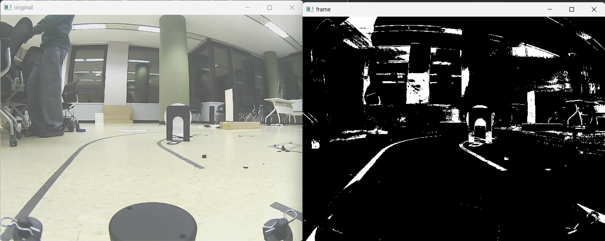
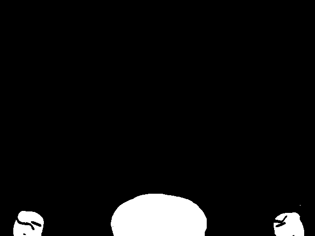

# Lanedetection_using_slidingwindow

<aside>
🚗 팀명 : 항상 엔진을 켜둘께<br>
팀원 : 이찬우, 허정은<br>
발표자 : 이찬우

</aside>

# 💡 프로젝트 기획

---

## 프로젝트 목표

해결하려는 문제를 간단히 요약하세요. 이 문제가 해결되어야 하는 이유는 무엇인가요?

1. **Offset에 가려진 Lidar**
2. **영상의 밝기 변화**
3. **차선 끊김** 

## 프로젝트에 사용한 알고리즘

프로젝트에 사용한 알고리즘과 이 알고리즘을 선택한 이유는 무엇인가요?

- Image Calibration
- Image Warping
- Gaussian Blurring
- Contrast Average Filter - CLIHE
- Adaptive Threshold
- Morphological Transformation - Opening
- **Sliding Window**
    
    → 오프라인 실습 이후에도 슬라이딩 윈도우 코드를 팀 작업을 통해 계속 수정하며 개선시키고 있었기 때문에 기존 코드를 사용하는 것이 더 좋은 퍼포먼스가 나올 것 같아서 선택하게 되었습니다. 
    

---

## 이슈사항

### 라이다를 차선으로 인식하는 문제

- 해당 문제에 대하여 저희는 **두 가지 해결법**을 찾았습니다.

### 방법 1

- **첫 번째는 warp point를 라이다 위쪽으로 잡아 라이다가 없는 화면의 차선을 보며 주행하는 방식입니다.**
    
    
    
- 진행할수록 라이다 부근의 차선 데이터에서 다른 차선 데이터보다 양질의 데이터를 얻을 수 있어 두 번째 방법으로 해결하였습니다.

### 방법 2

- **라이다의 mask image를 만들어 기존 이진영상에 subtract 연산을 수행해서 지우는 것입니다.**

---

- mask image를 만들기 위해 두 가지 방법을 시도해보았습니다.
    1. 처음으로 진행하였던 방법은 python OpenCV 모듈에 배경을 자동으로 지워주는 모델이 있어 영상에서 움직이지 않는 라이다 부분을 배경으로 생각하고 지워주지 않을까 하는 생각에 코드를 작성하여 결과를 내보았습니다.
        - 사용 모듈: cv2.bgsegm.createBackgroundSubtractorMOG()
            
            
            
        - 움직이지 않는 라이다 뿐 아니라 다른 배경까지도 지우는 성능을 보여주어 mask image를 만들기에는 적절하지 않다고 판단했습니다.
    2. **이전 프레임, 현재 프레임을 비교하여 min값을 추출해 나가며 마스크 만들기**
        - 라이다를 흰 색으로 인식하는 것을 보아 동영상 내에서 움직이지 않는 부분은 항상 흰 색(255)을 갖습니다. 따라서 움직이는 부분들과의 min값을 취해서 움직이지 않는 라이다 부분만을 추출하는 작업을 진행하였습니다.
            
            [2023-05-03 00-50-31.mkv](https://www.youtube.com/watch?v=NHQR2KVs6c0)
            

### 결과



### 히스토그램 균일화 알고리즘 선택 및 임계값 알고리즘 선택

### 히스토그램 균일화 알고리즘

- histogram equalization과 CLAHE(**Contrast Limited Adaptive Histogram Equalization) 두 알고리즘을 비교하여 선택하였습니다.**

### CLAHE 작동 방식


- 작은 블록의 타일의 크기를 지정하여 지정한 블록마다 균일화를 진행합니다. 각 타일 이미지에 노이즈가 섞여있는 경우 Contrast Limit 파라미터를 설정하여 노이즈 감쇠효과도 볼 수 있습니다.
- 타일별로 균일화 마무리 이후 타일 간 bilinear interpolation을 적용해 매끄러운 이미지를 출력합니다.

### CLAHE 작업 내용

```cpp
CV_EXPORTS_W Ptr<CLAHE> createCLAHE(double clipLimit = 40.0, Size tileGridSize = Size(8, 8));
```

> **clip limit** : histogram의 높이를 제한하는 값
> 
> 
> clip limit 값에 따른 차이를 비교해 보았습니다.
> 
1. clipLimit = 40(default)
    
    
    
2. clipLimit = 5
    
    
    
3. clipLimit = 1
    
    
    
- **1도 좋았으나 중간 중간 소금 후추 노이즈가 끼는 곳이 보여 파라미터 자료형이 double인 점을 감안해 더 줄여보았습니다.**
1. clipLimit = 0.1
    
    
    
- **0.2 이하의 값으로는 비슷한 전처리 효과를 보였습니다. 따라서 파라미터 값은 0.2로 설정하였습니다.**

### **histogram equalization & CLAHE 비교**


[2023-05-03 23-10-04.mkv](README_source/2023-05-03_23-10-04.mkv)

### 임계값 알고리즘

- 고정된 threshold값으로 이진화를 하는 방법과 adaptivethreshold를 적용하여 이진화를 하는 방법 두 가지중 어떤 방법이 나은지 고민해보았습니다.
- 히스토그램 균일화를 통해 영상의 전반적인 명암을 조정해도 고정된 임계값이 adaptivethreshold보다 노이즈에 취약한 모습을 보였습니다.

---

- **프로젝트에 adaptivethreshold를 적용하기 위해 block size 파라미터를 바꾸며 최적화 작업을 진행하였습니다.**
- block size만큼 해당 픽셀 주변의 평균, 가우시안을 계산하고, 그 값에 c를 뺀 만큼을 해당 픽셀의 threshold로 지정해 이진화하기 때문에 **block size와 c값을 바꾸면서 테스트 진행**했습니다.
    1. block size = 101, 101 경우 
        
        [101, 101.mov](https://www.youtube.com/watch?v=ymkxL57l-Vw)
        
    2. block size = 201, 201 경우 
        
        [201, 201.mov](https://www.youtube.com/watch?v=EjSdB8O8dSo)
        
    3. block size = 301, 301 경우 
        
        [301, 301.mov](https://www.youtube.com/watch?v=wXdF6P4uBLM)
        
- block size는 최소 3이상 홀수로 지정해야하고, 구글링을 통해 찾아봤을 때 보통 9-15사이의 값을 지정하는 예시가 많았습니다.
- c값도 보통 10 이하로 설정을 했기 때문에 그대로 적용해 한번 테스트를 진행했었는데, 너무 엉망진창인 이진화면이 출력되어서, 예시 보고서대로 block size는 (301, 301)로 잡고 c값을 조절해보았습니다.
- c를 20으로 잡았을 때 전체적으로 노이즈도 없어지고 화면이 깔끔해지는 것 같아, 우선 c는 20으로 고정하고 block size를 101, 201, 301로 테스트 했습니다.

### 히스토그램 균일화 알고리즘 및 임계값 알고리즘 적용 영상

- 아래 슬라이딩 윈도우가 adaptive, 위가 고정 threshold 영상입니다.

---

1. CLAHE - adaptivethreshold vs CLAHE- threshold
    
    [2023-05-05 00-10-07.mkv](README_source/2023-05-05_00-10-07.mkv)
    
2. CLAHE- adaptivethreshold vs CLAHE- threshold + threshold_OTSU
    
    [2023-05-05 00-07-52.mkv](README_source/2023-05-05_00-07-52.mkv)
    

### 화이트 노이즈 제거

- 영상 내 차선 주변에 작은 테이프와 같은 노이즈들이 섞여 가끔 차선으로 인식되는 경우가 있었습니다.
- Morphological Transformation 중 Opening은 영상에 erosion 후에 dilation을 해 주어 erosion의 화이트 노이즈 제거 효과와 dilation의 객체 크기 확대 효과 모두를 갖게 해줍니다.

[https://1stapplepie.github.io/til/Morphological_Transformations/](https://1stapplepie.github.io/til/Morphological_Transformations/)

---

### Kernel 사이즈를 변경하며 비교해보기

1. kernel = (5, 5)
    
    
    
2. kernel = (7, 7)
    
    
    
3. kernel = (10, 10)
    
    
    
- 이미지의 우측 위에 있는 노이즈를 기준으로 kernel = (7, 7)부터 확실하게 지우기 시작하였으며, 그 이상으로 커널을 키우게 되면 차선의 일부가 지워져 프로젝트 수행에 문제가 되었습니다. 따라서 kernel = (6, 6)으로 지정하여 사용하였습니다.

### **좌, 우 차선의 기준이 되는 히스토그램 범위**

- 슬라이딩 윈도우 예제 파일을 바탕으로 작업을 시작하였는데 모든 슬라이딩 윈도우의 차선 기준이 화면의 중앙을 기준으로 되어있어 차선이 화면 반대로 넘어가면 반대 차선으로 인식하는 문제점이 있었습니다.
    
    
    
- 처음 슬라이딩 윈도우만 화면의 중앙을 기준으로 좌, 우 차선을 인식하도록 변경하였습니다.
    
    
    
- 첫 슬라이딩 윈도우를 그린 후에는 해당 슬라이딩 윈도우의 x값을 기준으로 좌, 우 마진값 이내에 위치하는 히스토그램에서 차선을 인식하도록 변경하였습니다.
    
    
    


- 처리 후 차선 인식 결과입니다.
    
    
    

---

## 협업 과정

- 게더를 사용해 회의를 진행했습니다.
    
    
    
    2023-5-4 전반적인 진행 과정을 정하고, 각자 할 일을 분배했습니다. 
    

# 🏁 프로젝트 결과

---

## 결과 영상

[화면 기록 2023-05-05 오후 2.50.37.mov](README_source/%25E1%2584%2592%25E1%2585%25AA%25E1%2584%2586%25E1%2585%25A7%25E1%2586%25AB_%25E1%2584%2580%25E1%2585%25B5%25E1%2584%2585%25E1%2585%25A9%25E1%2586%25A8_2023-05-05_%25E1%2584%258B%25E1%2585%25A9%25E1%2584%2592%25E1%2585%25AE_2.50.37.mov)

- 첫 슬라이딩 윈도우를 그린 후에는 해당 슬라이딩 윈도우의 x값을 기준으로 좌, 우 마진값 이내에 위치하는 히스토그램에서 차선을 인식하도록 변경하였습니다.
- 라이다의 mask image를 만들어 기존 이진영상에 subtract 연산을 수행해서 지우는 것으로 라이다를 차선으로 인식하는 문제를 해결했습니다.
- CLAHE(Contrast Limited Adaptive Histogram Equalization)과  adaptivethreshold를 적용해 영상 밝기 문제와 노이즈를 해결했습니다.
- morphological 변환으로 화이트 노이즈를 제거했습니다.

# 📢 향후 작업 및 소감 (선택)

---

프로젝트가 끝난 이후에도 더 작업을 진행한다면 어떤 부분들을 할 예정인가요?

- bird-eye-view상에서 차선 인식은 완료하였는데 해당 이미지에서 원본 좌표로 변환하는 과정에서 어려움이 있었습니다.
시간이 부족해서 아직 해결하지는 못했던 부분이라 추후에 더 진행해 볼 예정입니다.

- 온라인 프로젝트에서 도입한 몇 가지 알고리즘들은 오프라인 프로젝트에서는 사용할 수 없을만큼 처리 시간이 길 것 같습니다. 오프라인 프로젝트에서도 사용할 수 있는 알고리즘에 대하여 조금 더 고민해 볼 생각입니다.

---
